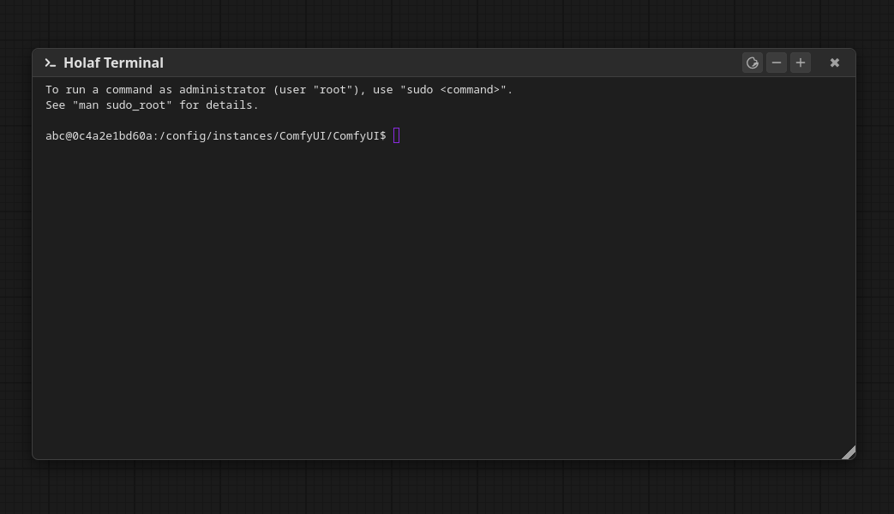
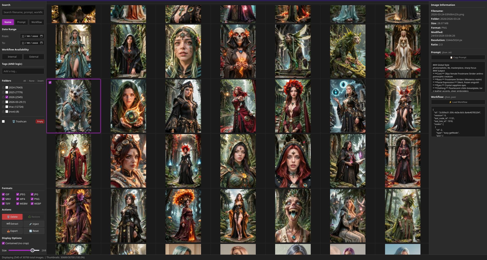
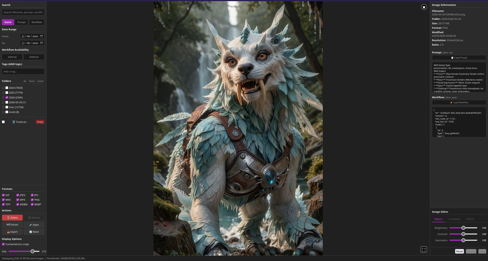
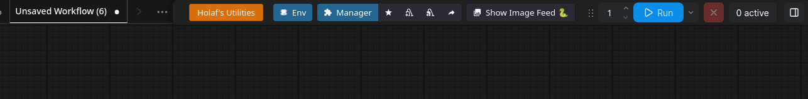
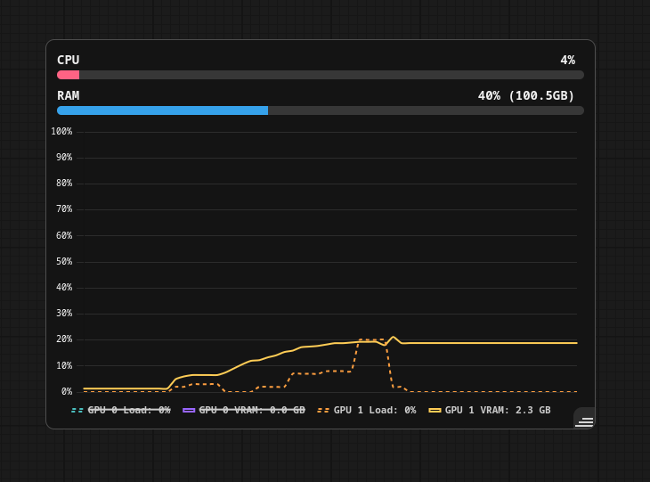
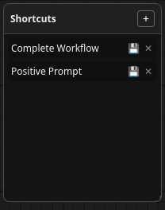
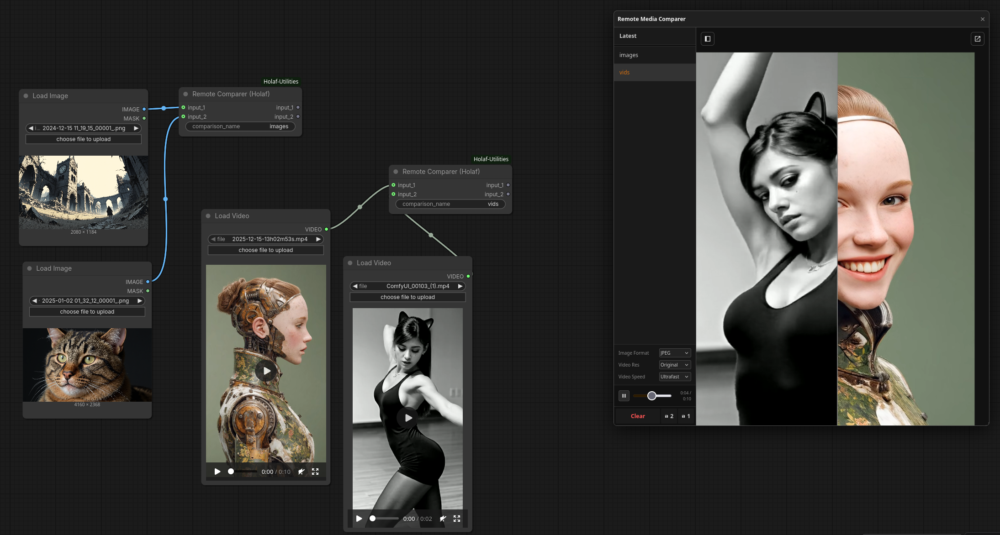

# Holaf Utilities - Features Overview

    Welcome to the Holaf Utilities extension suite for ComfyUI. This document provides an overview of the core modules designed to enhance your workflow, monitor your system, and streamline your creative process.

    ---

    ## 1. Terminal

    A fully integrated, robust terminal emulator directly within ComfyUI.

    
    
    **Key Features:**
    *   **Native Emulation:** Powered by `pywinpty` (Windows) and `pty` (Linux/Mac) for true terminal behavior.
    *   **Real-time Interaction:** Run shell commands, manage packages, or monitor background tasks without leaving your workflow environment.
    *   **Seamless UI:** Built with `xterm.js` for a smooth, standard-compliant command-line experience.
    *   **Opens in ComfyUI directory with the corresponding environment (conda/venv/portable version)
    ---

    ## 2. Image Viewer

    A comprehensive, state-driven gallery.

    
    

    **Key Features:**
    *   Browse and filter generated images and videos.
    *   extract prompt+workflow and save them in separate files. 
    *   reinject workflow from the gallery into comfyUI
    *   simple edition of images (edit of video not finished)
    *   pop out the gallery in another window

    ---

    ## 3. Compact Menu Bar

    Maximize your canvas space by merging the ComfyUI Tab Bar and Action Bar into a single, unified row.

    

    *   Reclaims crucial pixels at the top of your screen.

    ---

    ## 4. System Monitor

    A floating hardware monitor overlay.

    

    ---

    ## 5. Shortcuts (Viewport Bookmarks)

    Never lose your place in massive workflows again. Save and recall exact graph locations.

    
    *Add screenshot showing the shortcuts list and subgraph paths.*

    **Key Features:**
    *   **Pan & Zoom Bookmarks:** Save specific viewport coordinates and zoom levels to jump between specific areas of your graph instantly.
    *   **Nested Subgraph Navigation:** Fully supports recursive path detection. Bookmarks can teleport you directly inside deep subgraphs with a stable context switch.
    *   **Dual Persistence:** Shortcuts are saved both locally (for your window state) and embedded directly within the workflow data (`app.graph.extra`), meaning your bookmarks travel with your `.json` saves.

    ---

    ## 6. Universal Remote Comparer

    pop-out comparison tool.

    

    **Key Features:**
    *   **Supports Image/Video/audio
    *   **Side-by-Side & Crossfader:** Native canvas zoom/pan handles visual media splits. For audio, your mouse X-position drives a smooth, 100% center crossfader between sources A and B.
    *   **Multi-Monitor Pop-Out Architecture:** Detach the active canvas into a completely new browser window (`window.open`) for dual-monitor setups.
    *   **Dynamic Audio HUD:** Visualizes audio status independently of canvas scaling.
    *   **Global Settings Bridge:** Configure backend compression, resolutions, and FFmpeg speeds via a centralized UI that communicates directly with the Python API.